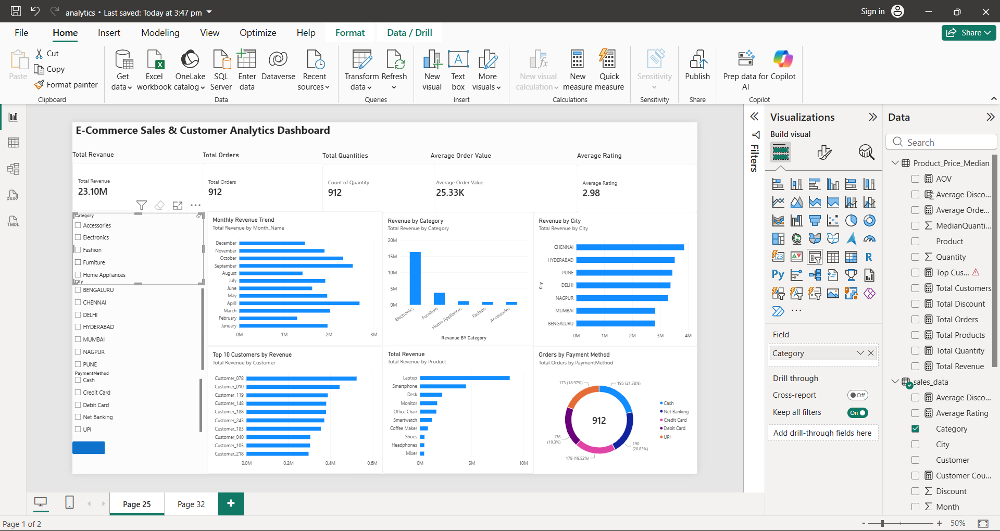

# E-Commerce Sales & Customer Analytics

An end-to-end data analytics project exploring transaction patterns, customer behavior, and sales metrics using Power BI.

---

## 📊 Project Overview
- **Objective:** Analyze e-commerce sales performance, customer purchasing trends, and revenue drivers to generate actionable business insights.
- **Tools Used:** Power BI, DAX, Power Query, Excel/CSV

---

## 📁 Repository Structure
- `analytics.pbix` — Interactive Power BI dashboard report.
- `ecommerce_sales_raw.csv` — Source transactional sales dataset.
- `README.md` — Project overview and documentation.

---

## 💡 Key Analysis & Insights
- **Sales Trends:** Tracking revenue, total orders, and average order value across different time periods.
- **Product Performance:** Identifying top-selling categories, high-margin items, and underperforming products.
- **Customer Segmentation:** Evaluating repeat purchase rates and customer order distributions.

---

## 🚀 How to Run the Report
1. Download `analytics.pbix` from this repository.
2. Open the file in [Power BI Desktop](https://powerbi.microsoft.com/desktop/).
3. Explore the dashboard pages using the interactive filters and slicers.

---

---
##markdown

